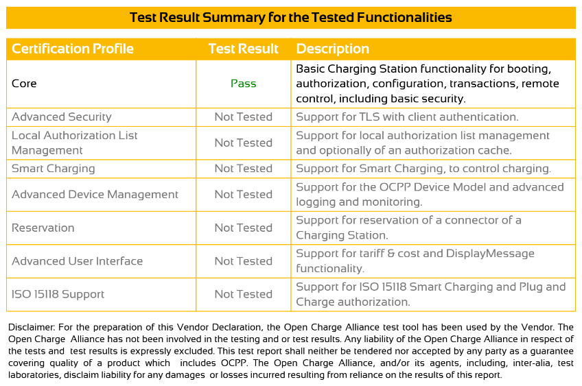

# OpenOCPP

Multi-platform OCPP 1.6/2.0.1 embedded software for charging stations.

Website: [https://openocpp.com](https://openocpp.com)

## Certifications
This project has been tested and passed core test cases as part of the OCTT 2.0.1 Vendor Declaration of Conformance:


For more information on specific capabilities please contact support@openocpp.com

## ESP32 Demo
### Getting started
The ESP32 demo in this project depends on the **ESP-IDF** toolchain version **v5.2.3**. Setup instructions can be found 
here:

- https://docs.espressif.com/projects/esp-idf/en/v5.2.5/esp32/get-started/index.html

An example setup process on an **Ubuntu VM** is provided below:

```shell
# Install Prerequisites
sudo apt-get install git wget flex bison gperf python3 python3-pip python3-venv cmake ninja-build ccache libffi-dev libssl-dev dfu-util libusb-1.0-0

# Get ESP-IDF
mkdir -p ~/esp
cd ~/esp
git clone -b v5.2.5 --recursive https://github.com/espressif/esp-idf.git

# Set up the Tools
cd ~/esp/esp-idf
./install.sh esp32

# Activate ESP-IDF
. $HOME/esp/esp-idf/export.sh
```

Note: the activation step above must be run every time a new terminal is opened before running any of the `idf.py` 
commands.

### Building the project

Open a terminal in the OpenOCPP project directory and run the following commands:

```shell
# Navigate to the demo-esp32 folder (if necessary) 
cd demo-esp32

# Active ESP-IDF (if necessary)
. $HOME/esp/esp-idf/export.sh

# Build the project - note: this step will take a few minutes
idf.py build
```

### Running the project

From a terminal in the OpenOCPP project run the following commands:

```shell
# Navigate to the demo-esp32 folder (if necessary) 
cd demo-esp32

# Active ESP-IDF (if necessary)
. $HOME/esp/esp-idf/export.sh

# Flash and run the project
idf.py -p /dev/ttyUSB0 flash && idf.py -p /dev/ttyUSB0 monitor
```

Note that the above assumes that the ESP32 module/dev kit is connected to the `/dev/ttyUSB0` interface in the system/VM.

_For example:_ an ESP32 dev kit plugged into the host machine can generally be exposed to a KVM VM as follows:

- Press: Add Hardware 
- Select: USB Host Device 
- Select: Silicon Labs CP210x UART Bridge 
- Press: Finish

Assuming the firmware is flashed successfully onto the ESP32 module the `monitor` command will restart the firmware and 
begin trailing the log messages. This should look something like the following:

```text
I (31) boot: ESP-IDF v5.2.3 2nd stage bootloader
I (31) boot: compile time Feb 24 2025 10:14:06
I (31) boot: Multicore bootloader
I (35) boot: chip revision: v3.0
I (39) boot.esp32: SPI Speed      : 80MHz
I (44) boot.esp32: SPI Mode       : DIO
I (48) boot.esp32: SPI Flash Size : 4MB
I (53) boot: Enabling RNG early entropy source...
I (58) boot: Partition Table:
I (62) boot: ## Label            Usage          Type ST Offset   Length
I (69) boot:  0 nvs              WiFi data        01 02 00009000 00003000
I (77) boot:  1 pmjournal        Unknown data     01 06 0000c000 00002000
I (84) boot:  2 otadata          OTA data         01 00 0000e000 00002000
I (92) boot:  3 app1             OTA app          00 11 00010000 001e0000
I (99) boot:  4 app0             OTA app          00 10 001f0000 001e0000
I (106) boot:  5 spiffs           Unknown data     01 82 003d0000 0002f000
I (114) boot:  6 sernr            NVS keys         01 04 003ff000 00001000
I (122) boot: End of partition table
...
```

### Provisioning to the simulator

When the firmware finishes initializing it begins broadcasting an open wifi access point for provisioning purposes named 
**Charger Simulator**. Connect to the access point and perform the following steps to connect the device to an OCPP 
back-end:

- Open https://192.168.4.1 in your browser
  - Note that both an HTTP and HTTPS server (with a self-signed certificate) is run for the purpose of the demo
- Accept the self-signed certificate
- Submit the provisioning information:
  - Select the Wifi network (may take a moment to load)
  - Enter/confirm the Wifi password
  - Enter the OCPP network URL - for example:
    - ws://0123456789abcdef.octt.openchargealliance.org:25316
    - wss://my-ocpp-backend.com
  - Enter the OCPP ID to use
    - The value here is appended to the network URL, for example with an OCPP ID of TEST the simulator will connect to 
      the following URLs in the examples above:
      - ws://0123456789abcdef.octt.openchargealliance.org:25316/TEST
      - wss://my-ocpp-backend.com/TEST
  - Select the OCPP protocol to use
  - Press: Submit

After the above is completed the simulator will restart and connect to the provided OCPP back-end.

### Connecting to the running simulator

The running simulator can be controlled either by connecting to the simulator's IP address on the Wifi network it's 
connected to, or by re-connecting to the **Charger Simulator** Wifi network. Note that the **Charger Simulator** network 
will require the same password used to connect to the Wifi network after provisioning is complete.

When connected to the simulator the state of the device can be controlled via a web interface:

- Connect to the simulator
  - Connect to the simulator's IP address on the local Wifi network: https://192.168.1.X
  - Connect directly to the simulator's access point:
    - Open https://192.168.4.1 in your browser (if your local network does not use the 192.168 prefix), otherwise
    - Open https://10.0.0.1 in your browser (if your local network does use the 192.168 prefix)
- Select the **Configuration** tab to alter the charger's configuration, such as:
  - Altering the default networking profile slot/configuration
- Select the **Control** tab to control the simulator, such as:
  - Simulate connecting/disconnecting a vehicle
  - Simulate charging suspended by EV/EVSE
  - Simulate an RFID or other local authorization
